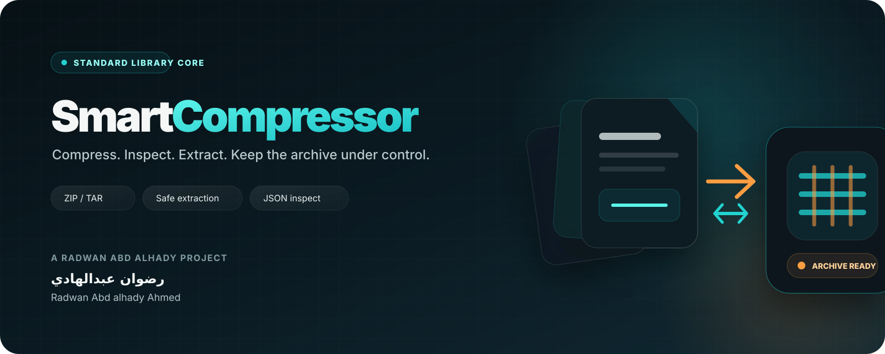

 

# Smart Compressor

### A dependency-free archive toolkit for safe local compression, inspection, and extraction

**[English guide](README_EN.md) · [الدليل العربي](README_AR.md) · [Architecture](docs/ARCHITECTURE.md) · [Brand](docs/BRAND.md) · [Security](SECURITY.md)**

---

## One toolkit for archive work

**Smart Compressor** is a local Python CLI and library for creating, inspecting, and safely extracting common archive formats using only the standard library at runtime.

**باختصار:** أداة محلية لضغط الملفات والمجلدات وفحص الأرشيفات وفكها بأمان، من دون برامج ضغط خارجية أو خدمات سحابية أو اعتماديات تشغيل إضافية.

| Capability | Current behavior |
|---|---|
| Compression | ZIP · TAR.GZ · TAR.BZ2 · TAR.XZ · GZ · BZ2 · XZ |
| Inspection | Member count · packed bytes · unpacked bytes · ratio |
| Extraction | Supported formats with destination-boundary checks |
| Path safety | Rejects archive members escaping the destination |
| TAR safety | Rejects symlinks, hard links, devices, and special members |
| Existing files | Protected unless overwrite is explicit |
| Archive creation | Temporary file + atomic destination replace |
| Automation | JSON output for CLI workflows |
| Runtime | Python standard library only |
| Network | No network client or API key required |

---

## Quick start

~~~bash
git clone https://github.com/rad03i2/smart-compressor.git
cd smart-compressor

python -m pip install -e .
~~~

Create a ZIP archive:

~~~bash
smart-compressor compress ./documents ./documents.zip
~~~

Create a high-level XZ stream for one file:

~~~bash
smart-compressor compress report.csv report.csv.xz --level 9
~~~

Create a TAR.XZ directory archive:

~~~bash
smart-compressor compress ./project ./project.tar.xz
~~~

Inspect without extracting:

~~~bash
smart-compressor inspect ./documents.zip
smart-compressor inspect ./documents.zip --json
~~~

Extract safely:

~~~bash
smart-compressor extract ./documents.zip ./restored
~~~

Use overwrite only when replacement is intentional:

~~~bash
smart-compressor extract ./documents.zip ./restored --overwrite
~~~

---

## Supported formats

### Directories

| Suffix | Container / compression |
|---|---|
| <code>.zip</code> | ZIP with Deflate |
| <code>.tar.gz</code> / <code>.tgz</code> | TAR + gzip |
| <code>.tar.bz2</code> / <code>.tbz2</code> | TAR + bzip2 |
| <code>.tar.xz</code> / <code>.txz</code> | TAR + xz |

### Individual files

In addition to ZIP and TAR-based outputs where applicable, individual files can use:

- <code>.gz</code>
- <code>.bz2</code>
- <code>.xz</code>

The output format is inferred from the destination filename.

> The <code>--level 0-9</code> option affects formats where the underlying standard-library API exposes that level in the current implementation. TAR-compressed modes currently use the standard-library defaults.

---

## Archive safety model

~~~text
archive
  │
  ├─ enumerate members
  ├─ resolve each target under destination
  ├─ reject path traversal
  ├─ TAR: reject links and special members
  ├─ protect existing files by default
  └─ stream accepted file contents
        │
        v
   destination
~~~

The extraction logic is designed to prevent classic <code>../</code> path traversal / Zip Slip behavior.

However, archive safety is broader than path traversal. Unknown archives can still consume excessive CPU, memory, or disk through compression-bomb behavior. Smart Compressor currently does **not** enforce resource quotas.

See [SECURITY.md](SECURITY.md).

---

## Inspect before extracting

~~~bash
smart-compressor inspect backup.tar.xz
~~~

Example fields reported:

~~~text
Archive: /path/to/backup.tar.xz
Format: tar.xz
Members: ...
Packed: ... bytes
Unpacked: ... bytes
Ratio: ...
~~~

For automation:

~~~bash
smart-compressor inspect backup.tar.xz --json
~~~

The ratio represents packed bytes divided by unpacked bytes. It is an archive-size metric, not a universal measure of content quality or compression efficiency.

---

## Python API

~~~python
from smart_compressor import compress, extract, inspect_archive

info = compress("documents", "documents.zip", level=6)

print(info.members)
print(info.packed_bytes)
print(info.unpacked_bytes)
print(info.ratio)

extract("documents.zip", "restored")

archive = inspect_archive("documents.zip")
print(archive.to_dict())
~~~

The public API exports:

- <code>compress()</code>
- <code>extract()</code>
- <code>inspect_archive()</code>
- <code>CompressionError</code>

---

## Quality checks

~~~bash
python -m compileall -q src tests
python -m unittest discover -s tests -v
smart-compressor --version
~~~

The GitHub Actions matrix runs these checks on **Ubuntu, Windows, and macOS** with Python **3.10, 3.12, and 3.13**.

Current regression tests cover ZIP round-trip behavior, single-file GZIP, TAR.XZ, overwrite protection, invalid levels, and a Zip Slip attempt.

---

## Repository map

~~~text
smart-compressor/
├── assets/
│   ├── project-cover.svg       Archive Forge repository hero
│   └── project-logo.svg        square project mark
├── docs/
│   ├── ARCHITECTURE.md         compression and extraction internals
│   └── BRAND.md                visual identity rules
├── src/smart_compressor/
│   ├── __init__.py             public Python API
│   ├── core.py                 compression, inspection, extraction
│   └── cli.py                  command-line interface
├── tests/
│   └── test_core.py            functional + security regressions
├── .github/
│   ├── ISSUE_TEMPLATE/
│   ├── PULL_REQUEST_TEMPLATE.md
│   ├── CODEOWNERS
│   └── workflows/ci.yml
├── README_EN.md
├── README_AR.md
├── CHANGELOG.md
├── SUPPORT.md
├── SECURITY.md
├── CONTRIBUTING.md
└── LICENSE
~~~

---

## Current boundaries

Smart Compressor currently does **not** provide:

- RAR or 7z support;
- Zstandard support;
- password-protected or encrypted archives;
- split / multipart archives;
- a desktop GUI;
- automatic compression-bomb resource limits;
- rollback of files already extracted before a later fail-fast error.

It also does not perform media-specific recompression of images, video, or audio. ZIP compression uses standard Deflate behavior rather than re-encoding the underlying media.

---

## Project identity

The **Archive Forge** identity represents data streams converging into a compact archive core. Electric cyan represents structure and verified boundaries; warm copper represents compression and transformation.

**Developer:** **Radwan Abd alhady Ahmed** · **رضوان عبدالهادي**  
GitHub: [@rad03i2](https://github.com/rad03i2)

 

---

## License

MIT — see [LICENSE](LICENSE).
